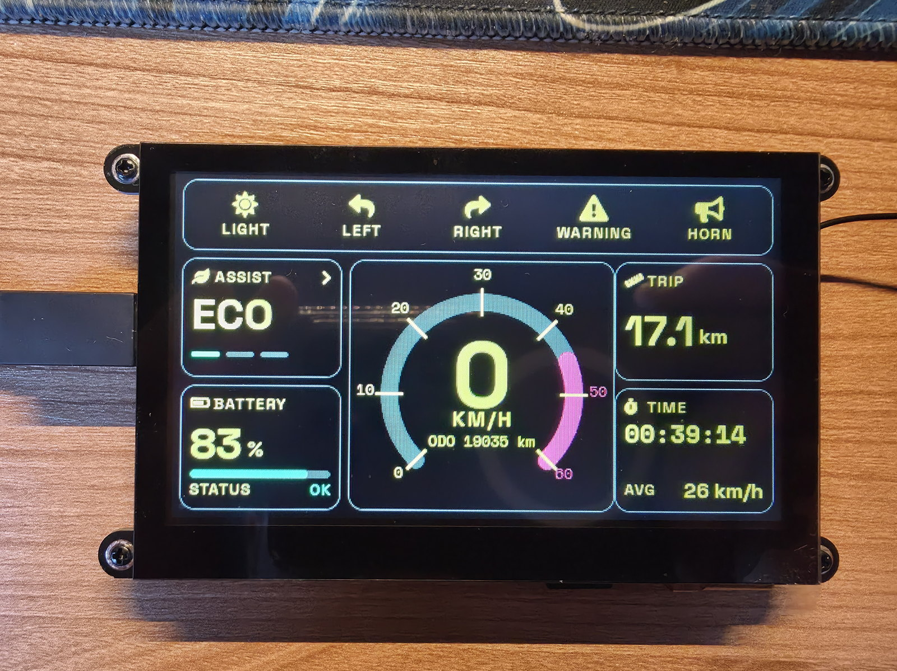
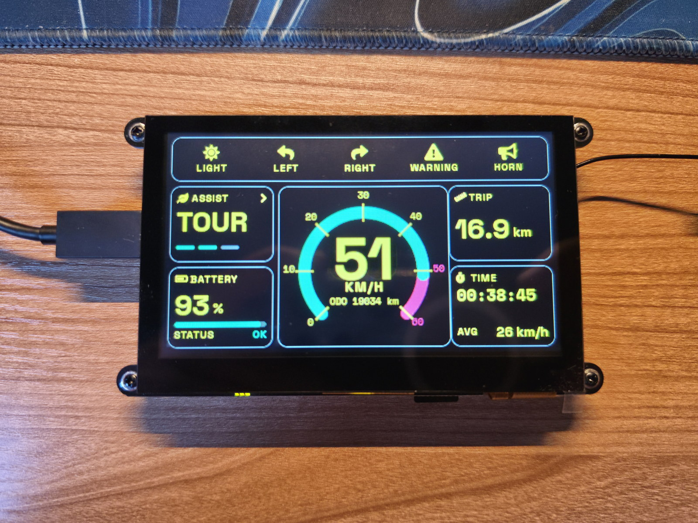
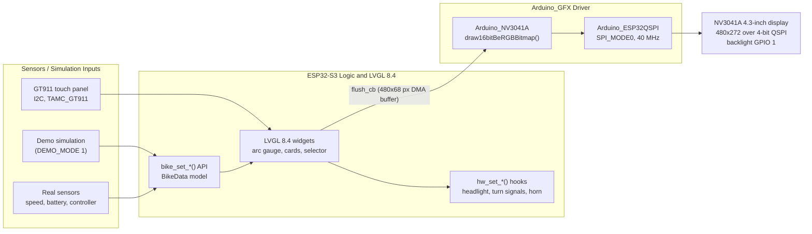

# E-Bike Smart Dashboard (ESP32-S3)


A touch-screen instrument cluster for electric bikes, built on the **Guition JC4827W543** board
(ESP32-S3, 4.3-inch 480x272 TFT, NV3041A controller on a 4-bit QSPI bus, GT911 capacitive touch).
The interface is rendered with **LVGL 8.4** on top of **Arduino_GFX**, in landscape, and is designed
to be read at a glance from the handlebar in full daylight.

---

## Hardware Gallery

| Idle state | High-speed state |
|:---:|:---:|
|  |  |
| **Pic-01: idle, USB-C powered.** The bike is stopped: the speedometer reads **0 km/h**, the assist mode is **ECO** with one of three level dashes lit, and the battery card shows **83 %** with a full-length green bar and an `OK` status. The trip card reports 17.1 km, the time card 00:39:14 of riding and a 26 km/h average. The five-button command bar (LIGHT, LEFT, RIGHT, WARNING, HORN) is idle in amber. Note the clean black bezel: with a pure-black background the display blends into the frame and only the data glows. | **Pic-02: riding at 51 km/h in TOUR mode.** The green arc has swept past the 45 km/h mark into the red zone, the 72 px digits stay fully legible, and the assist card shows **TOUR** with two level dashes. The **RIGHT** turn signal is active: its icon switches to orange and blinks until it is cancelled from the screen. Battery at **93 %**, trip 16.9 km, ride time 00:38:45, average 26 km/h. |

---

## Table of Contents

1. [Project Overview](#project-overview)
2. [Key Features](#key-features)
3. [Screen Layout](#screen-layout)
4. [System Architecture](#system-architecture)
5. [Hardware](#hardware)
6. [Software Stack](#software-stack)
7. [Project Structure](#project-structure)
8. [Build and Flash](#build-and-flash)
9. [Configuration](#configuration)
10. [Connecting Real Sensors](#connecting-real-sensors)
11. [Custom Fonts](#custom-fonts)
12. [Troubleshooting](#troubleshooting)
13. [License](#license)

---

## Project Overview

The dashboard uses a **high-contrast dark theme** tuned for outdoor use:

- **Pure black background** (`#000000`) on every card and panel, so the IPS panel emits light only
  where there is information. There are no grey gradients, no transparency effects and no white,
  which keeps glare and washout to a minimum in direct sunlight.
- **Two-level yellow hierarchy**: live values (speed, battery, trip, time) in fluorescent yellow
  `#FFE600`, captions, units and icons in amber `#FFC800`. The eye separates data from labels
  without reading.
- **Standard indicator colours**: green `#00E676` for the headlight, the speed arc and a healthy
  battery; orange `#FF8C00` for turn signals, hazard lights and a low battery; red `#FF1744` for the
  gauge red zone and a critical battery.
- **Rapid glanceability**: the speed is drawn with custom 72 px bold digits in the centre of a
  270-degree arc gauge, and every touch target is at least 88 x 46 px so it can be hit while riding.
- **Strict English UI**: every label, status and serial message is in English.

The firmware ships with a **simulation mode** (`DEMO_MODE 1`) that animates speed, trip distance,
odometer, battery level and assist mode, so the complete interface can be evaluated on the bench
before any sensor is connected.

---

## Key Features

- **Real-time digital speedometer**: 72 px bold digits, 270-degree arc gauge with tick marks every
  10 km/h and a red zone above 45 km/h (0 to 60 km/h scale, or 0 to 40 mph with `USE_MPH`).
- **Dynamic battery gauge**: large percentage, horizontal level bar and a `STATUS` line that switches
  between `OK`, `LOW` (below 20 %) and `CRITICAL` (below 10 %) with matching green, orange and red.
- **Assist mode selection**: ECO / TOUR / SPORT with level dashes. Tapping the ASSIST card opens a
  full-screen selector with three 282 x 52 px rows, a `CURRENT` marker and a `CANCEL` button.
- **Trip metrics**: trip distance (0.1 km resolution), elapsed ride time (counts only while moving),
  odometer under the speed gauge and average speed computed on board.
- **Indicator lights**: LIGHT (headlight toggle, green when on), LEFT and RIGHT turn signals
  (mutually exclusive, blinking orange), WARNING hazard lights (both arrows blink orange) and a
  momentary HORN button. Every state change is forwarded to a hardware hook.
- **Bench simulation**: speed sweeps 0 to 52 km/h and back, battery drains 1 % every 3 s, assist mode
  rotates every 12 s, trip and odometer integrate the simulated speed.
- **Boot self-test**: before LVGL starts, Arduino_GFX draws four colour bars and prints the bus
  frequency, PSRAM and flash size on screen for 1.5 s, which makes display bring-up problems obvious.
- **Serial diagnostics** at 115200 baud over native USB: memory report, display init result, LVGL
  buffer and pool sizes, every touch press with raw and mapped coordinates.

---

## Screen Layout

```text
+--------------------------------------------------------------------------+
|  [ LIGHT ]   [ LEFT ]   [ RIGHT ]   [ WARNING ]   [ HORN ]   (88x46 px)  |
+---------------+------------------------------------------+---------------+
| ASSIST      > |            30                            | TRIP          |
| ECO           |      20    /|\    40                     | 17.1 km       |
| -- -- --      |   10   /   0   \   50                    +---------------+
+---------------+  0   |  KM/H  |  60 (red zone 45-60)     | TIME          |
| BATTERY       |      \ ODO 19035 km /                    | 00:39:14      |
| 83 %  [=====] |            arc gauge                     | AVG 26 km/h   |
| STATUS     OK |                                          |               |
+---------------+------------------------------------------+---------------+
```

Resolution 480 x 272, landscape (rotation 0). Cards are 126 px wide on the sides and the gauge
card is 210 px wide in the centre.

---

## System Architecture



Data flow in one sentence: inputs update a small `BikeData` model through the `bike_set_*()` API,
LVGL redraws only the invalidated widgets into a 480 x 68 px buffer in internal DMA RAM, and each
flush is pushed to the panel as a big-endian RGB565 bitmap through the Arduino_GFX QSPI bus.

---

## Hardware

### Board

| Item | Value |
|---|---|
| Board | Guition JC4827W543 |
| Module | ESP32-S3-WROOM-1-N4R8 (dual-core 240 MHz) |
| Flash | 4 MB, QIO |
| PSRAM | 8 MB, octal (OPI) |
| Display | 4.3-inch IPS TFT, 480 x 272, NV3041A controller, 4-bit QSPI |
| Touch | GT911 capacitive, I2C |
| USB | USB-C, native USB CDC (serial console and flashing) |

### Display Pinout (QSPI)

| Signal | GPIO | Notes |
|---|---:|---|
| CS | 45 | Chip select, driven by software |
| SCK | 47 | QSPI clock, 40 MHz, SPI mode 0 |
| D0 | 21 | Data line 0 (MOSI role in 1-bit phases) |
| D1 | 48 | Data line 1 |
| D2 | 40 | Data line 2 |
| D3 | 39 | Data line 3 |
| Backlight | 1 | Active HIGH, driven as a plain output |
| Reset | none | Not wired, software reset (`GFX_NOT_DEFINED`) |

### Touch Pinout (I2C)

| Signal | GPIO | Notes |
|---|---:|---|
| SDA | 8 | `Wire` bus |
| SCL | 4 | |
| INT | 3 | Used during reset to select address 0x5D |
| RST | 38 | |

---

## Software Stack

| Component | Version | Role |
|---|---|---|
| VS Code + PlatformIO | PlatformIO Core 6.x | IDE and build system |
| Platform `espressif32` | 7.x (Arduino core 2.0.17, ESP-IDF 4.4.7) | Toolchain and framework |
| LVGL | 8.4.0 (`lvgl/lvgl@^8.3.11`) | UI widgets, layout, animations |
| Arduino_GFX | 1.5.9 (`moononournation/GFX Library for Arduino@1.5.9`) | NV3041A driver and QSPI bus |
| TAMC_GT911 | 1.0.2 (`tamctec/TAMC_GT911@^1.0.2`) | GT911 touch driver |

> **Why Arduino_GFX is pinned to 1.5.9.** Releases 1.6.x require the Arduino-ESP32 core 3.x
> (`esp32-hal-periman.h`), while this project runs on core 2.0.17. Version 1.5.9 is the latest
> release that builds on core 2.x and it fully supports `Arduino_NV3041A` and `Arduino_ESP32QSPI`.

Memory choices that matter:

- LVGL draw buffer: 480 x 68 px (one quarter of the screen) allocated in **internal DMA-capable RAM**,
  so the QSPI DMA transfers read it directly.
- LVGL memory pool: 128 KB, allocated in **PSRAM** when available with an automatic fallback to
  internal RAM.
- Loop task stack raised to 16 KB for LVGL rendering.
- Partition table `huge_app.csv`: 3 MB for the application on the 4 MB flash, no OTA.

---

## Project Structure

```text
ebike_esp32/
├── platformio.ini              # single environment: jc4827w543
├── include/
│   └── lv_conf.h               # LVGL 8 configuration (fonts, memory pool, colour swap)
├── src/
│   ├── main.cpp                # display setup, LVGL glue, UI, data API, simulation
│   └── fonts/                  # generated LVGL fonts (Space Grotesk, Space Mono, FontAwesome)
│       ├── cb_speed_72.c       # 72 px digits for the speedometer
│       ├── cb_bold_34.c        # assist mode, battery %, trip
│       ├── cb_bold_20.c        # toolbar icons, selector titles
│       ├── cb_bold_16.c        # units and buttons
│       ├── cb_medium_12.c      # captions and icons
│       ├── cb_mono_12.c        # gauge ticks, odometer
│       ├── cb_mono_20.c        # ride time
│       └── README.md           # how the fonts were generated
├── tools/fonts/                # TTF sources, generation script, layout preview script
├── docs/                       # rendered layout previews (PNG)
└── images/                     # hardware photos (web-sized copies used in this README)
```

---

## Build and Flash

### Prerequisites

- [VS Code](https://code.visualstudio.com/) with the **PlatformIO IDE** extension, or PlatformIO Core
  (`pip install platformio`).
- A USB-C data cable. The board exposes the ESP32-S3 native USB port; no external UART adapter is
  needed.
- No manual library installation: `platformio.ini` lists every dependency and PlatformIO downloads
  them on the first build.

### Option A: VS Code

1. Open the project folder in VS Code (`File > Open Folder...`).
2. Wait for PlatformIO to finish indexing (status bar at the bottom).
3. Connect the board over USB-C.
4. Click **Build** (check-mark icon) in the PlatformIO status bar, then **Upload** (arrow icon).
5. Click **Serial Monitor** (plug icon) to follow the boot log at 115200 baud.

The single environment `jc4827w543` is selected automatically, and the COM port is auto-detected.

### Option B: PlatformIO CLI

```bash
# 1. Build the firmware
pio run

# 2. Build and upload (port auto-detected)
pio run --target upload

# 3. Open the serial monitor (115200 baud, exception decoder enabled)
pio device monitor

# Optional: upload and monitor in one step
pio run --target upload && pio device monitor

# Optional: force a specific port
pio run --target upload --upload-port COM5

# Optional: clean build
pio run --target clean && pio run
```

### What you should see

1. The screen lights up with **four colour bars** (red, green, blue, yellow) and a text block
   `NV3041A QSPI SELF-TEST` for about 1.5 s. This confirms the QSPI bus, the panel and the backlight.
2. The dashboard appears in simulation: the speed sweeps up and down, the battery slowly drains and
   the assist mode rotates. Tap the ASSIST card to open the mode selector, tap the toolbar buttons
   to toggle the indicators.
3. The serial monitor prints something like:

```text
=== E-bike dashboard (high-contrast) - JC4827W543 ===
[SYS] Flash 4 MB, CPU 240 MHz, loop task stack 15xxx B free
[MEM] PSRAM: found, 8192 KB (8xxx KB free)
[MEM] Internal RAM: 3xx KB free, DMA-capable: 3xx KB free
[LCD] NV3041A QSPI (Arduino_GFX) init OK, 480x272 landscape, rotation 0, SPI_MODE0 @ 40 MHz, IPS 1, backlight GPIO 1 HIGH
[TOUCH] GT911 initialised on I2C (SDA 8, SCL 4), address 0x5D
[LVGL] v8.4.0, draw buffer 32640 px (63 KB), pool 128 KB (x% used)
[DEMO] Simulation running (DEMO_MODE=1)
[OK] Ready
[TOUCH] raw=(212,88) -> screen=(212,88)
[HW] Assist mode: SPORT
```

If the upload succeeds but the board does not restart by itself, press the **RESET** button once.

---

## Configuration

All options live at the top of `src/main.cpp`. The hardware-tuning macros are guarded by `#ifndef`,
so they can be overridden from `platformio.ini` without editing the source by adding
`-D<NAME>=<value>` to `build_flags`:

| Macro | Default | Purpose |
|---|---|---|
| `JC4827_LCD_SPI_FREQ` | `40000000` | QSPI clock in Hz; try `20000000` on marginal wiring |
| `JC4827_LCD_IPS` | `true` | Sends the colour-inversion command required by this IPS panel |
| `JC4827_TP_FLIP_X` / `JC4827_TP_FLIP_Y` / `JC4827_TP_SWAP_XY` | `0` | Touch axis mapping if a press lands mirrored |

The remaining settings are plain definitions and constants, edited directly in `src/main.cpp`:

| Setting | Default | Purpose |
|---|---|---|
| `DEMO_MODE` | `1` | `1` = simulated data, `0` = wait for `bike_set_*()` calls |
| `USE_MPH` | `0` | `1` = display in MPH / miles (0 to 40 scale), API stays metric |
| `JC4827_LCD_ROTATION` | `0` | `0` landscape, `2` landscape rotated 180 degrees |
| `SPEED_MAX` / `SPEED_RED_FROM` | `60` / `45` km/h | Gauge scale and start of the red zone |
| `BATT_LOW_PCT` / `BATT_CRIT_PCT` | `20` / `10` | Battery status thresholds |
| `LV_BUF_LINES` | `68` | Height of the LVGL draw buffer in rows (one quarter of the screen) |

`ARDUINO_USB_CDC_ON_BOOT=1` in `platformio.ini` routes the serial console to the native USB port;
set it to `0` only for a board revision that has a UART bridge chip.

Build flags already set in `platformio.ini`: `BOARD_HAS_PSRAM`, `LV_CONF_INCLUDE_SIMPLE`,
`ARDUINO_USB_MODE=1`, `ARDUINO_USB_CDC_ON_BOOT=1`, plus the memory type `qio_opi`, flash size 4 MB
and the `huge_app.csv` partition table.

---

## Connecting Real Sensors

Set `DEMO_MODE` to `0` and feed the dashboard from your sensors or motor controller. The public API
takes metric units and updates the widgets immediately:

```cpp
bike_set_speed(float kmh);          // wheel or controller speed
bike_set_battery(uint8_t pct);      // 0..100
bike_set_trip(float km);            // trip distance
bike_set_odo(float km);             // total distance
bike_set_mode(AssistMode m);        // MODE_ECO, MODE_TOUR, MODE_SPORT
```

Ride time and average speed are computed on board from the speed you provide, so they need no
extra input. Outputs go through five hooks in `src/main.cpp`; replace the `Serial.printf` body with
your GPIO or CAN logic:

```cpp
static void hw_set_headlight(bool on);
static void hw_set_turn_signal(bool left, bool right);
static void hw_set_hazard(bool on);
static void hw_set_horn(bool on);            // momentary: true on press, false on release
static void hw_set_assist_mode(AssistMode m);
```

---

## Custom Fonts

LVGL's built-in fonts stop at 48 px, so the dashboard uses fonts generated with
[`lv_font_conv`](https://github.com/lvgl/lv_font_conv) from **Space Grotesk** (Bold, Medium),
**Space Mono** (Regular, Bold) and the FontAwesome 5 icon set bundled with LVGL. The generated `.c`
files live in `src/fonts/`, the TTF sources in `tools/fonts/`. To regenerate them (Node.js required):

```bash
bash tools/fonts/generate_fonts.sh
```

`tools/fonts/apercu_mise_en_page.js` renders the layout previews stored in `docs/` with the exact
coordinates, fonts and colours used by the firmware (`npm i @napi-rs/canvas` first).

---

## Troubleshooting

| Symptom | What to check |
|---|---|
| Screen stays black, serial log is fine | Confirm the four colour bars appear at boot. If not, lower `JC4827_LCD_SPI_FREQ` to `20000000` and check the QSPI pin table above. |
| Colours are inverted (white background) | The panel needs the inversion command: keep `JC4827_LCD_IPS` at `true`. |
| Touch works but is mirrored or swapped | Watch the `[TOUCH] raw=... -> screen=...` lines and set `JC4827_TP_FLIP_X`, `JC4827_TP_FLIP_Y` or `JC4827_TP_SWAP_XY` to `1`. |
| No serial output at all | The board uses native USB CDC: keep `ARDUINO_USB_CDC_ON_BOOT=1` and open the monitor at 115200 baud. Allow up to 2 s after reset. |
| Build error `esp32-hal-periman.h: No such file` | Arduino_GFX resolved to 1.6.x. Keep the pinned `@1.5.9` in `platformio.ini`. |
| Board does not reboot after upload | Press the RESET button once. |
| PSRAM reported as `NOT FOUND` | The module must be an N4R8 (octal PSRAM). The firmware still runs with the LVGL pool in internal RAM. |

---

## License

- Project source code: add the license of your choice (for example MIT) in a `LICENSE` file.
- Fonts: Space Grotesk and Space Mono are distributed under the
  [SIL Open Font License 1.1](src/fonts/LICENSE-SpaceGrotesk-OFL.txt); FontAwesome 5 Free icons
  are bundled with LVGL under their own licence.
- Third-party libraries: [LVGL](https://github.com/lvgl/lvgl) (MIT),
  [Arduino_GFX](https://github.com/moononournation/Arduino_GFX) and
  [TAMC_GT911](https://github.com/tamctec/gt911-arduino), each under its own licence.
